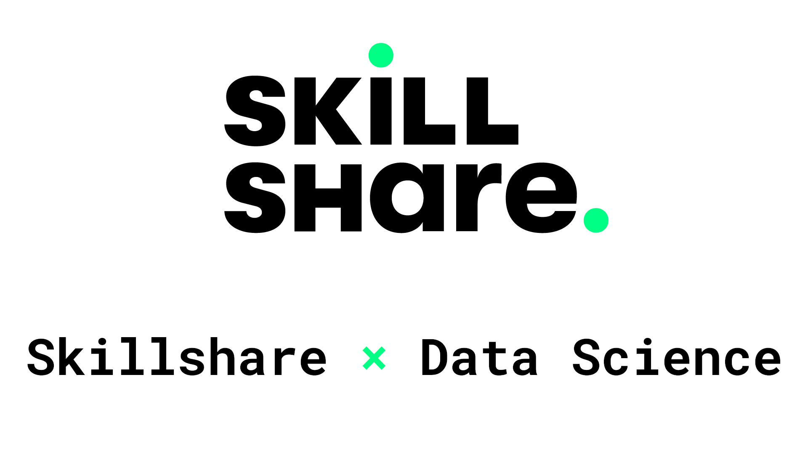

# Skillshare Data Science and Business Analytics in Python
[Skillshare - Data Science and Business Analytics with Python](https://dramsch.net/course1)

Free Trial of Skillshare Premium for this course and many many others

Download [all Code](https://github.com/jesperdramsch/skillshare-data-science/archive/main.zip) or [only Notebooks](https://github.com/jesperdramsch/skillshare-data-science/blob/main/notebooks.zip)

Read the notebooks online on: [Data-Science-Gui.de](https://data-science-gui.de).

Table of Contents
---

- [Description](#description)
- [Data](#data)
- [Notebooks](#notebooks)
  1. [Data Loading](#data-loading)
  2. [Data Cleaning](#data-cleaning)
  3. [Exploratory Data Analysis](#exploratory-data-analysis)
  4. [Machine Learning](#machine-learning)
  5. [Machine Learning Validation](#machine-learning-validation)
  6. [Data Visualization](#data-visualization)
  7. [Report Generation](#report-generation)
- [Class Project](#class-project)

---
## Description

Machine learning and data science have become important skills across all industries. Knowing both how to perform analytics, as well as, sense checking analyses and understanding concepts is key in making decisions today.

Python has become the lingua franca of data science and is, therefore, the topic of this class.

Programming can be intimidating, however, Python excels due to its readability and being freely available for all platforms including Linux, Mac and Windows. This class will assume some prior knowledge of Python syntax, but to establish a common learning environment some of the basics will be covered. We will cover the full data science workflow including:

- Loading data from files (e.g. Excel tables) and databases (e.g. SQL servers)
- Data cleaning
- Exploratory data analysis
- Machine learning
- Model validation and churn analysis
- Data visualization and report generation

In this class we will  use freely and openly available Python libraries including: Jupyter, NumPy, SciPy, Pandas, MatPlotLib, Seaborn, and Scikit-Learn and you will also learn how to quickly learn new libraries.

## Data

The original data is collected in

> Pace, R. Kelley, and Ronald Barry. "Sparse spatial autoregressions." Statistics & Probability Letters 33.3 (1997): 291-297.

Modifications were made by

> Géron, Aurélien. Hands-on machine learning with Scikit-Learn, Keras, and TensorFlow: Concepts, tools, and techniques to build intelligent systems. O'Reilly Media, 2019.

made available under the CC0 license on [Kaggle](https://www.kaggle.com/camnugent/california-housing-prices), with the following modifications from the original:

- 207 values were randomly removed from the total_bedrooms column, so we can discuss what to do with missing data.

- An additional categorical attribute called ocean_proximity was added, indicating (very roughly) whether each block group is near the ocean, near the Bay area, inland or on an island. This allows discussing what to do with categorical data.

## Notebooks

Click the "notebook" badge to view or the "colab" badge to try out the notebooks interactively.

## Data Loading
### Excel Files and CSV into Pandas

    

Loading data into Python from standard Excel files and comma-separated value (CSV) data is fundamental for many data scientists and analysts. 

Excel and CSV files are among the most common data storage formats. Python provides various tools to read, manipulate, and analyze this data. In this process, Excel files can be read using libraries like `pandas`, `xlrd`, and `openpyxl`. In contrast, CSV files can be imported using the built-in `csv` module or the `pandas` library. 

Understanding how to load data from these file formats is essential for data analysis and machine learning tasks in Python. This article will explore different methods to read data from Excel and CSV files and analyze some everyday use cases.
#### Additional Resources
- [Chris Albon on Loading CSVs](https://chrisalbon.com/python/data_wrangling/pandas_dataframe_importing_csv/)
- [Shane Lynn on `Read_CSV`](https://www.shanelynn.ie/python-pandas-read_csv-load-data-from-csv-files/)
### SQL data into Pandas

    

Many companies store data in central databases to ensure efficient data management, security, and accessibility. 

Structured Query Language (SQL) is the standard language for interacting with these databases, allowing users to extract and manipulate data. In recent years, Python has become a popular tool for data analysis and manipulation due to its flexibility, ease of use, and extensive libraries. Pandas is a powerful Python library for data manipulation, and it offers seamless integration with SQL databases through SQLAlchemy, a popular SQL toolkit for Python. 

By using Python, Pandas, and SQLAlchemy, users can access and analyze data stored in SQL databases and perform complex queries and data transformations. In this article, we will explore how to connect to a SQL database, retrieve data using SQL queries, and analyze the data using Pandas.
#### Additional Resources
- [Skillshare SQL course](https://www.skillshare.com/classes/SQL-Master-SQL-Database-Queries-in-Just-90-Mins/1192226128?via=jesperdramsch)
- [Kaggle Intro to SQL](https://www.kaggle.com/learn/intro-to-sql)
### Loading any file (like txt)

.ipynb) .ipynb) .ipynb) .ipynb) .ipynb)

Pandas works great on structured data, but sometimes data comes in weird formats. This is the general way to work with data files in Python.

Pandas is a powerful Python library for data manipulation and analysis, specifically designed for working with structured data. However, in real-world scenarios, data often comes in various formats, including unstructured, semi-structured, or poorly structured data. 

In such cases, working with these data files can be challenging, and often requires additional processing before analysis. 

In Python, there are various libraries and tools available to work with different data file formats, including JSON, XML, text, and binary files. In this article, we will explore how to work read any different types of data files in Python, raw. 

We will also discuss the general approach to handle data files, and how to use Pandas to manipulate and analyze the data once it has been loaded into memory.

### Dealing with huge datasets

    

Some data is too large for our small laptop. Some data is even too large for our terrabyte servers. Being smart about loading data can help us build better data science pipelines.

As data science and machine learning become increasingly popular, the size of data sets used for analysis has grown exponentially. Sometimes, the data is so large that it cannot be loaded into memory on a single machine, even on a terabyte server. 

In such cases, loading data can become a bottleneck, hindering data analysis and decision-making. To overcome this challenge, data scientists must be innovative about loading data and building efficient data pipelines. Various techniques and tools are available to process and analyze large datasets, including parallel computing, distributed systems, cloud computing, and data streaming. 

This notebook will discuss the challenges of loading large datasets and explore some best practices for building efficient data science pipelines to handle big data. We will also explore popular tools and techniques for processing and analyzing large datasets.
#### Additional Resources
- [Dask](https://dask.org/)
- [Making Pandas Fly](https://youtu.be/C1hqHk1SfrA?t=4551)
### Combining data sources

    

Data can come from different files and you can combine them in a single dataframe.

When working with data, storing data across multiple files or data sources is common. Combining data from different files or data sources into a single dataframe can be useful for data analysis and modelling. 

In Pandas, combining data from additional files or sources is done using the merge or join functions. These functions allow us to connect data based on a common key or index, which can be helpful when analyzing related data. 

This notebook will explore how to merge or join data from different files or sources into a single Pandas dataframe. We will also discuss different types of joins and merge operations and how to handle missing or duplicate data during the merging process.

## Data Cleaning
### Dealing with missing values

    

Dealing with missing values is a common challenge in data analysis and modelling. 

Missing data can occur for various reasons, including data entry errors, equipment failure, or simply because the data was not collected. Failing to handle missing data appropriately can lead to biased or inaccurate results. It may negatively impact the performance of machine learning models. 

This notebook will explore different strategies for handling missing data in Pandas, including removing missing data, imputing missing values with means or medians, and using advanced imputation techniques.
#### Additional Resources
- [Towards Data Science - Imputation](https://towardsdatascience.com/pandas-tricks-for-imputing-missing-data-63da3d14c0d6)
- [Scikit-Learn Imputation](https://scikit-learn.org/stable/modules/impute.html)
### Formatting and deduping data

    

Formatting columns and removing duplicates is an important part of data preparation.

Preparing data for analysis is a crucial step in any data science project. One aspect of data preparation is formatting columns and removing duplicates. Inaccurate or inconsistent formatting of columns can make it difficult to analyze data or even result in incorrect results. Similarly, duplicate data can skew analysis and lead to inaccurate conclusions. 

This notebook will explore how to format columns in Pandas dataframes to ensure data accuracy and consistency. We will also discuss detecting and removing duplicate data and handling missing values in columns. These techniques ensure data is adequately prepared for analysis and modelling, leading to more accurate and reliable results.
#### Additional Resources
- [Pandas Duplicated Documentation](https://pandas.pydata.org/pandas-docs/stable/reference/api/pandas.DataFrame.duplicated.html)
### Scaling and binning data

    

Data comes in all shapes and forms, but sometimes it's essential to get data into the same range of values. Sometimes scaling the data is not enough, but grouping data into similar categories is beneficial for analysis.

Data comes in various shapes and forms, including numerical, categorical, and textual data. Analyzing different types of data often requires extra preprocessing steps. 

In some cases, data needs to be standardized to a standard range of values, such as scaling numerical data. However, scaling alone may not be enough, and grouping data into similar categories can be more beneficial for analysis. Grouping data can also simplify complex datasets and improve the accuracy of models.

This notebook will discuss different techniques for grouping data, including binning, one-hot encoding, and clustering. We will also explore the benefits and limitations of each technique and how to choose the most appropriate method based on the data and analysis goals.
#### Additional Resources
- [Scikit-Learn Scaling](https://scikit-learn.org/stable/modules/preprocessing.html)
### Advanced Strategies (Schemas)

.ipynb) .ipynb) .ipynb) .ipynb) .ipynb)

Validating data to be within certain ranges is an advanced strategy when automating data science processes.

In data science, automation has become an essential aspect of various processes. 

One of the critical challenges in automating data science workflows is ensuring the accuracy and validity of the data being used. Validating data to be within certain ranges is an advanced strategy that can be employed to ensure that the data being used is reliable and accurate. This approach involves setting predetermined limits or ranges for specific data points and verifying that the data falls within these parameters. 

By implementing this strategy, data scientists can improve the accuracy and reliability of their automated data science workflows.

### Advanced Strategies (Encoding)

.ipynb) .ipynb) .ipynb) .ipynb) .ipynb)

Sometimes it's good to change data from one representation to another

Advanced strategies in data encoding involve converting information from one format or representation to another. This can be useful in various contexts, such as improving data storage efficiency, enhancing data security, and facilitating data processing and analysis. 

Encoding can involve various techniques, such as compression, encryption, and hashing. In some cases, encoding can also include transforming data to a format more suitable for a particular application or platform. 

Encoding strategies can help organizations to optimize their data management practices and improve the overall performance of their systems.

## Exploratory Data Analysis
### Exploratory Data Analysis

    

Exploratory Data Analysis (EDA) is essential in any data science project. The primary objective is to explore and understand the dataset at hand. 

In this process, data analysts use various statistical and visualization techniques to uncover patterns, identify trends, and extract valuable insights from the data. EDA enables analysts to deeply understand the data, including its distribution, correlation, and other relevant characteristics. It also helps them identify potential outliers, missing values, and other anomalies that could affect the quality of the analysis. 

EDA is a crucial step that helps data scientists lay the groundwork for building predictive models and making informed business decisions.

### Visualizing the data for EDA

    

Visualizations are an excellent start to explore data and see relationships between input features.

They provide an intuitive and easily digestible way to explore complex datasets and identify patterns and relationships between input features. Through visualizations, we can identify trends, outliers, and correlations that might only be apparent after traditional statistical analysis. Whether plotting scatterplots, histograms, or heatmaps, visualizations enable us to gain a deeper understanding of the data and help us communicate our findings effectively to others. 

Therefore, visualizations are an excellent starting point for any data analysis project. They can serve as a powerful tool for discovering insights and unlocking the potential of data.
#### Additional Resources
- [pyviz](https://pyviz.org/)
### Using descriptive statistics

    

Statistics describe important aspects of our data, often revealing deeper insights.

Statistics is a branch of mathematics concerned with data collection, analysis, interpretation, presentation, and organization. 

It plays a crucial role in various fields, from business and economics to healthcare and social sciences. Using statistical techniques, we can describe essential aspects of our data and uncover patterns and trends that may not be immediately apparent. Statistics can help us make informed decisions, identify potential problems, and evaluate the effectiveness of interventions.

In short, statistics can reveal more profound insights into our data and provide valuable information that can guide us in making better decisions.

### Selecting subsets

    

Selecting subsets of data to analyze can give deeper insights.

When dealing with large datasets, selecting subsets of data to analyze can provide more focused and meaningful insights than analyzing the entire dataset.

This approach allows researchers to identify patterns and trends within specific subgroups and gain a deeper understanding of the data. Additionally, selecting subsets of data can help to reduce the amount of noise and irrelevant information in the analysis, making it easier to draw accurate conclusions.

Whether analyzing data for scientific research or business intelligence, selecting the correct subset of data can be a crucial step in unlocking deeper insights and driving successful outcomes.

### Finding and understanding relationships in data

    

In today's data-driven world, we are constantly bombarded with vast amounts of information. However, this raw data is often meaningless without the ability to identify relationships and patterns within it.

Finding and understanding relationships in data is crucial for making informed decisions, developing predictive models, and discovering new insights. Through the use of statistical techniques and machine learning algorithms, we can uncover hidden connections and dependencies between variables, enabling us to make accurate predictions and improve our understanding of complex systems.

Whether in business, science, or everyday life, the ability to analyze and interpret data is becoming increasingly important, and finding relationships within it is an essential skill for success.
#### Additional Resources
- [Beyond Correlation](https://github.com/ianozsvald/beyond_correlation)
## Machine Learning
### Linear regression

    

A simple machine learning model that can uncover relationships in data.

Linear regression is a robust machine learning algorithm that is commonly used for modelling and analyzing data.

It is a simple and effective technique for discovering relationships between variables and predicting future outcomes. The basic premise of linear regression is to find the best linear relationship between the independent and dependent variables in a dataset. Doing so can help identify patterns, trends, and correlations in the data, enabling us to make informed decisions and accurate predictions.

Linear regression is a versatile tool with applications in various fields, from finance and economics to healthcare and engineering.
#### Additional Resources
- [Scikit-Learn Train Test Split](https://scikit-learn.org/stable/modules/generated/sklearn.model_selection.train_test_split.html)
- [Scikit-Learn Linear Regression](https://scikit-learn.org/stable/modules/generated/sklearn.linear_model.LinearRegression.html)
### Decision trees and random forests

    

Change up the machine learning models

Decision trees and random forests are popular machine learning techniques for classification and regression tasks. 

A decision tree is a tree-like model where each node represents a decision based on a feature, and each branch represents an outcome of that decision. On the other hand, random forests are an ensemble of decision trees where each tree is trained on a subset of the data and a random subset of the features. They are powerful and widely used algorithms in machine learning because they can handle large datasets, deal with missing values, and provide interpretable results. 

This notebook will explore decision trees and random forests in more detail and discuss their strengths and weaknesses.
#### Additional Resources
- [Random Forests](https://scikit-learn.org/stable/modules/generated/sklearn.ensemble.RandomForestRegressor.html)
### Machine learning classification

    

Building machine learning models to assign data to classes.

Machine learning has become an increasingly popular tool for solving classification problems. 

The goal is to assign data points to pre-defined classes based on their features or attributes. This technique has numerous applications in a wide range of fields, from image and speech recognition to fraud detection and spam filtering. Building machine learning models to assign data to classes involves training algorithms on labelled datasets. Each data point is associated with a specific class label. By analyzing the relationships between the input features and the output labels, these models can learn to accurately classify new, unseen data points with high accuracy. 

In this way, machine learning provides a powerful tool for automating classification tasks and enabling more efficient and effective decision-making.

### Clustering for deeper data insights

    

Clustering exploits inherent structures in data to find relationships and memberships to groups in an unsupervised way. It can be used for data mining to generate additional insights.

Clustering is a popular technique used in data analysis to group similar data points together based on their inherent patterns and structures. 

It enables researchers and analysts to uncover hidden relationships within data sets and better understand complex systems. With the increasing volume of data generated by organizations and individuals, clustering has become a valuable tool for mining and exploration. Using clustering algorithms, it is possible to identify distinct subgroups within large data sets and gain deeper insights into complex phenomena, such as customer behaviour, market trends, and scientific phenomena. 

In this article, we will explore the benefits of clustering for deeper data insights and discuss some of the most popular clustering algorithms used today.
#### Additional Resources
- [HDBSCAN](https://hdbscan.readthedocs.io/en/latest/)
## Machine Learning Validation
### Validating machine learning models

    

Once we built a machine learning model, we need to validate that this model learnt something meaningful from our training. This part is machine learning validation.

Validating a machine learning model is essential in developing any data-driven solution. 

It ensures that the model performs as intended and has learned relevant patterns from the data. Validation involves assessing a model's accuracy, reliability, and generalization performance. Machine learning validation is crucial because models can easily overfit the training data, making them unreliable in real-world scenarios. 

This process involves splitting the data into training and validation sets, evaluating the model's performance on the validation set, and tuning the model parameters until an acceptable level of performance is achieved.
#### Additional Resources
- [Dummy Models](https://scikit-learn.org/stable/modules/generated/sklearn.dummy.DummyClassifier.html)
- [ML Fairness](https://en.wikipedia.org/wiki/Fairness_(machine_learning))
### Machine learning interpretability

    

In modern day machine learning it is important to be able to explain how our models "think". A simple accuracy score isn't enough. This notebook explores the lesson on interpretability.

Machine learning interpretability is an increasingly important topic in artificial intelligence. 

As machine learning models become more complex, understanding how they make predictions is becoming more difficult. This lack of transparency can lead to a lack of trust in the model. It can make it difficult to identify and correct errors. Interpretability is the ability to explain how a machine learning model arrived at a particular decision. It is essential to build trust and understanding in these powerful tools. 

This notebook will explore the importance of interpretability and provide practical examples of how it can be achieved.
#### Additional Resources
- [Scikit Yellowbrick](https://www.scikit-yb.org/en/latest/)
### Machine learning fairness

    

Machine Learning fairness is an important part of modern day data modeling. Here we explore an introduction to make models more fair and equitable.

Machine learning is a powerful tool that has revolutionized many industries by enabling computers to learn from data and make predictions or decisions.

However, as machine learning algorithms become increasingly ubiquitous in our daily lives, concerns about fairness and equity have emerged. Machine learning fairness refers to the idea that machine learning models should not perpetuate or exacerbate existing biases or discrimination. Fairness means that the model treats all individuals or groups fairly, regardless of race, gender, ethnicity, or other protected characteristics.

This notebook will provide an overview of the key concepts and challenges in machine learning fairness, as well as some techniques commonly used to address them.
#### Additional Resources
- [ML Fairness Gym](https://ai.googleblog.com/2020/02/ml-fairness-gym-tool-for-exploring-long.html)
- [F A T M L](https://www.fatml.org/)
## Data Visualization
### Basics of data visualization

    

We used data visualizations throughout this course. Here, we explore how to modify and enhance these figures.

Data visualization presents information and data using visual elements such as charts, graphs, and maps. 

It is a powerful tool that can help us understand complex data sets quickly and efficiently, enabling us to make better-informed decisions. In this notebook, we will delve into the basics of data visualization, including the types of visualizations commonly used, their benefits and limitations, and some tips and tricks to enhance and modify these figures to better communicate our insights. 

Whether you are a data analyst, researcher, or simply someone interested in exploring data, this notebook will provide the necessary foundational knowledge to create effective and impactful data visualizations.

### Visualizing geospatial data

    

Generating maps from data is a nice way to generate additional insight into data and make it instantly accessible and understandable.

Visualizing geospatial data is a powerful tool for gaining insights and understanding patterns in data. 

By mapping data onto a geographic space, it is possible to uncover relationships and trends that might otherwise be difficult to discern. Whether tracking the spread of a virus across the globe, identifying traffic jams in a city, or analyzing consumer behaviour across different regions, geospatial visualization can reveal patterns and relationships that might not be immediately apparent from raw data alone. 

With advances in technology and data analytics, creating maps and visualizations has become easier and more accessible than ever, making it a valuable tool for researchers, policymakers, and businesses.

## Report Generation
### Exporting Visualizations and data

    

Sometimes we want to save checkpoints from our data. That means we need to save the data in an appropriate format. The same goes for visualizations that can be used in presentations, reports, and designs.

Exporting data and visualizations are essential in many fields, such as data analysis, machine learning, and visualization design. 

It involves converting data and visualizations into a format easily shared and used by others. Data export can be crucial when we need to save the state of our analysis or share it with colleagues or clients. Visualizations, on the other hand, can help communicate insights more effectively. Still, they must also be exported in a format that retains their quality and allows them to be easily inserted into presentations or documents. 

In this context, understanding how to export data and visualizations is vital for anyone who works with data or creates visualizations.
#### Additional Resources
- [Matplotlib Savefig](https://matplotlib.org/api/_as_gen/matplotlib.pyplot.savefig.html#matplotlib.pyplot.savefig)
- [Exporting Holoviews](http://holoviews.org/user_guide/Exporting_and_Archiving.html)
### How to Save Presentations in Jupyter

    

Presentations can be an integral part of reporting and communicating results. With Reveal.js we can automatically generate presentations directly from jupyter.

They are frequently employed to present research findings, business reports, or educational material visually appealingly. Jupyter, a popular tool among data scientists and programmers, provides a powerful platform for creating presentations through Reveal.js. Reveal.js is a library that enables users to produce HTML presentations directly from Jupyter notebooks, allowing them to incorporate code, images, and text into a visually appealing format. 

In this notebook, we will explore how to save presentations in Jupyter and provide tips for optimizing your presentation.

### Generating PDF Reports

    

Jupyter Notebook is a popular tool for interactive computing, data analysis, and scientific research. 

Generating reports directly from Jupyter can be done directly to PDF if LaTeX is installed. Otherwise, we can use the route of exporting HTML. Moreover, `nbconvert --execute` can be used to re-run the entire notebook for that clean and fresh look.

One of the most critical aspects of using Jupyter is the ability to generate reports directly from the Notebook, allowing users to present their findings and results in a clear and organized way. Generating PDFs directly from Jupyter can be done if LaTeX is installed, but exporting to HTML is also an option. Additionally, the `nbconvert --execute` command can ensure that the Notebook is fully up-to-date and presentable for generating the final report. 

In this notebook, we will explore the process of generating PDFs directly from Jupyter and highlight the benefits of this feature.
#### Additional Resources
- [LaTeX](https://www.latex-project.org/get/)
## Class Project

Create a PDF report of a data analysis in Python with at least one visualization.

**Assignment:** Use a dataset you have from a project you are working on. Prepare and analyze this data and create at least one meaningful visualization. The data could be sales, expenses, or your FitBit data! Make sure to anonymize the data in case anything is sensitive information! (If you don’t have any data, I have some data listed and even a data set you can use below!)

**Deliverable:** Create a Jupyter Notebook describing your analysis process that contains at least one visualization that tells a compelling story.

**Details:** The project will consist of loading data and performing the exploratory data analysis and visualizations outlined in the class. The project is relatively straight-forward, as the class will follow an applied structure that can be revisited for parts of the project analysis.

Students are encouraged to use their own datasets for the analysis, as these yield the most benefit in learning. Alternatively, it is also possible to search for data sets in the following places:

- OpenML: <https://www.openml.org/search?type=data>
- Google: <https://datasetsearch.research.google.com/>
- Amazon: <https://registry.opendata.aws/>
- Kaggle: <https://www.kaggle.com/datasets>
- Awesome Data: <https://github.com/awesomedata/awesome-public-datasets>

In addition, to encourage sharing, I will provide one example data set on Skillshare, where people can explore and apply the learnings from this class. This dataset contains California Housing Sales from the 1990 census.

Help each other! Data science thrives from collaboration. Students are encouraged to learn from each other and give feedback on tips and tricks they found during their own analysis. Use the project tab early and often and also check what others have accomplished and leave feedback and likes.

Installing all the libraries: When you have conda installed, you can easily use the environment.yml in the notebooks.zip it contains all libraries. Open it with a text editor to see the command to get the environment set up.

### [Sign Up here](https://dramsch.net/course1)

